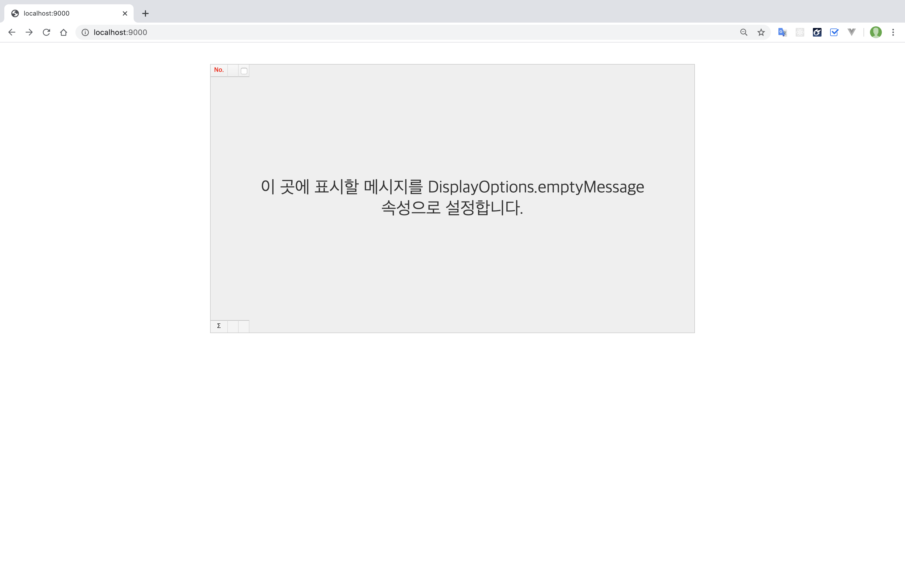

# RealGrid2 Webpack 예제

RealGrid2를 Webpack 용으로 완전히 빌드 가능한 예제 프로젝트입니다.

> 이 예제에는 `localhost` 도메인에서 실행 할 수 있는 개발용 라이선스를 포함하고 있습니다.

## 설치

```sh
git clone https://github.com/realgrid/realgrid2-examples.git
cd realgrid2-examples/webpack
npm install
```

## 빌드 명령

```
npm run build
npm run watch 
npm run clean
```

## 웹 개발

RealGrid2는 도메인 라이선스를 채택하고 있습니다. 브라우저에서 index.html 파일만 열어서는 라이선스 관련 오류를 만나게 됩니다. 따라서 웹 개발을 위한 서버를 구동하기 위해 [webpack-dev-server]() 가 포함되어 있습니다.

웹 개발을 위해 다음을 실행합니다.

```
npm run dev
```

브라우저에서 주소에 `http://localhost:9000`를 입력하고 RealGrid2가 포함된 화면을 확인하세요.

